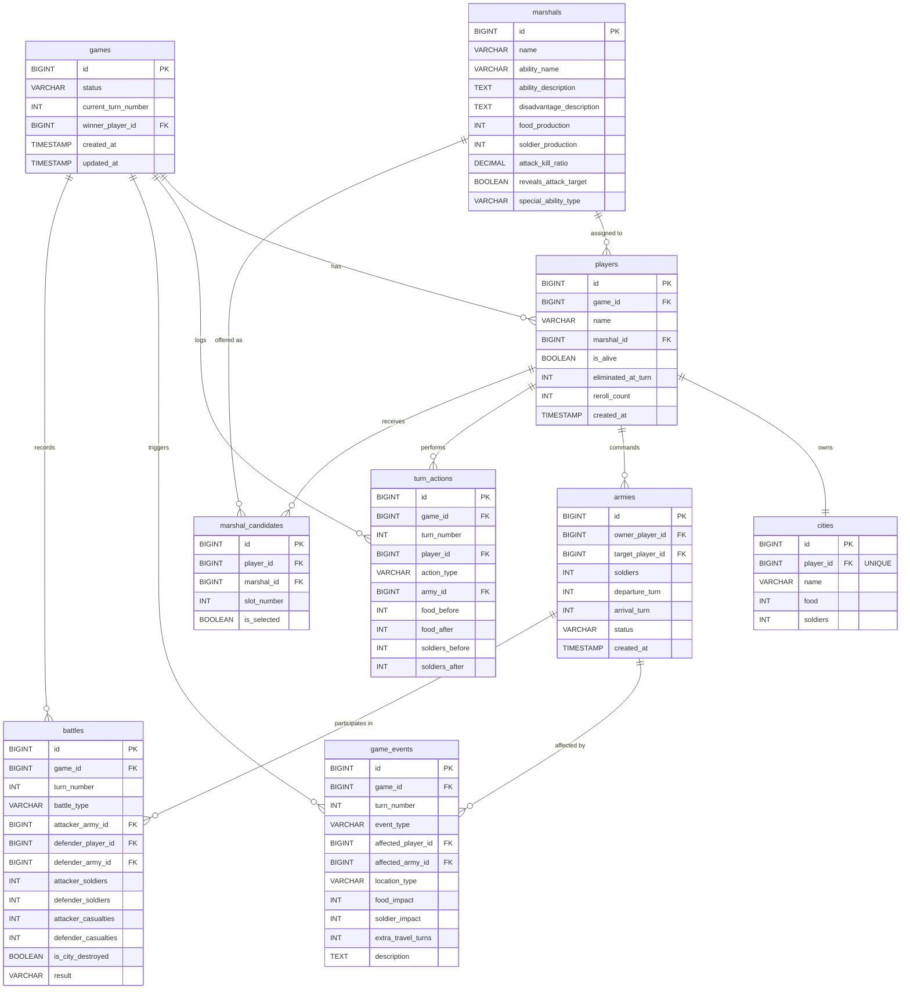

# 🗄️ EternalClash2 — Database Design

## ER Diagram



---

## Relationships Summary

| ความสัมพันธ์ | ประเภท | คำอธิบาย |
|---|---|---|
| `games` → `players` | **One-to-Many** | 1 เกมมีหลายผู้เล่น |
| `players` ↔ `cities` | **One-to-One** | 1 ผู้เล่นมี 1 เมือง (UNIQUE FK) |
| `players` → `armies` | **One-to-Many** | 1 ผู้เล่นส่งได้หลายกองทัพ |
| `players` → `marshal_candidates` | **One-to-Many** | 1 ผู้เล่นได้รับ 3 ตัวเลือกจอมพล |
| `marshals` → `players` | **One-to-Many** | 1 จอมพลถูกเลือกโดยหลายผู้เล่น (คนละเกม) |
| `marshals` → `marshal_candidates` | **One-to-Many** | 1 จอมพลเป็นตัวเลือกของหลายผู้เล่น |
| `games` → `turn_actions` | **One-to-Many** | 1 เกมมีหลาย Action log |
| `games` → `game_events` | **One-to-Many** | 1 เกมมีหลาย Event |
| `games` → `battles` | **One-to-Many** | 1 เกมมีหลายการต่อสู้ |

---

## Data Dictionary

### 1. `games` — ข้อมูลเกม

| Column | Type | Constraint | Description |
|---|---|---|---|
| `id` | BIGINT | PK, AUTO_INCREMENT | รหัสเกม |
| `status` | VARCHAR(20) | NOT NULL, DEFAULT 'WAITING' | สถานะเกม: `WAITING`, `MARSHAL_SELECTION`, `IN_PROGRESS`, `FINISHED` |
| `current_turn_number` | INT | NOT NULL, DEFAULT 0 | Turn ปัจจุบัน (ฤดูและกลางวัน/กลางคืนคำนวณจากค่านี้) |
| `winner_player_id` | BIGINT | FK → players, NULLABLE | ผู้ชนะ (NULL ถ้ายังไม่จบ) |
| `created_at` | TIMESTAMP | NOT NULL | วันที่สร้างเกม |
| `updated_at` | TIMESTAMP | NOT NULL | วันที่อัพเดตล่าสุด |

> [!TIP] **ฤดูและกลางวัน/กลางคืนคำนวณจาก `current_turn_number`**
> - **ฤดู:** `(turn - 1) % 12` → 0–3 = ร้อน, 4–7 = ฝน, 8–11 = หนาว
> - **กลางวัน/กลางคืน:** Turn เลขคี่ = กลางวัน, Turn เลขคู่ = กลางคืน

---

### 2. `marshals` — ข้อมูลจอมพล (Reference Data)

| Column | Type | Constraint | Description |
|---|---|---|---|
| `id` | BIGINT | PK, AUTO_INCREMENT | รหัสจอมพล |
| `name` | VARCHAR(50) | NOT NULL, UNIQUE | ชื่อจอมพล (จูล่ง, ลิโป้, จิวยี่, ขงเบ้ง, ซุนกวน, เล่าปี่, โจโฉ) |
| `ability_name` | VARCHAR(100) | NOT NULL | ชื่อความสามารถ |
| `ability_description` | TEXT | NOT NULL | คำอธิบายความสามารถ |
| `disadvantage_description` | TEXT | NOT NULL | คำอธิบายข้อเสีย |
| `food_production` | INT | NOT NULL, DEFAULT 20 | อาหารที่ผลิตได้ต่อครั้ง |
| `soldier_production` | INT | NOT NULL, DEFAULT 20 | ทหารที่สร้างได้ต่อครั้ง |
| `attack_kill_ratio` | DECIMAL(3,2) | NOT NULL, DEFAULT 1.00 | อัตราการฆ่า (ทหาร 1 คนฆ่าศัตรูได้กี่คน) |
| `reveals_attack_target` | BOOLEAN | NOT NULL, DEFAULT FALSE | เปิดเผยเป้าหมายโจมตีหรือไม่ (เล่าปี่ = TRUE) |
| `special_ability_type` | VARCHAR(30) | NULLABLE | ประเภทความสามารถพิเศษ: `FAST_MARCH`, `NO_ACCIDENT`, `SURVIVE_DESTRUCTION`, `REBELLION` |

**ค่าเริ่มต้นของจอมพลทั้ง 7:**

| จอมพล | food_production | soldier_production | attack_kill_ratio | special |
|---|---|---|---|---|
| จูล่ง | 20 | 20 | 1.00 | `FAST_MARCH` |
| ลิโป้ | 15 | 20 | 2.00 | — |
| จิวยี่ | 20 | 20 | 1.00 | `NO_ACCIDENT` |
| ขงเบ้ง | 20 | 20 | 1.00 | `SURVIVE_DESTRUCTION` |
| ซุนกวน | 25 | 20 | 0.67 | — |
| เล่าปี่ | 20 | 25 | 1.00 | reveals_target = TRUE |
| โจโฉ | 25 | 25 | 1.00 | `REBELLION` |

---

### 3. `players` — ผู้เล่น

| Column | Type | Constraint | Description |
|---|---|---|---|
| `id` | BIGINT | PK, AUTO_INCREMENT | รหัสผู้เล่น |
| `game_id` | BIGINT | FK → games, NOT NULL | เกมที่เข้าร่วม |
| `name` | VARCHAR(50) | NOT NULL | ชื่อผู้เล่น |
| `marshal_id` | BIGINT | FK → marshals, NULLABLE | จอมพลที่เลือก (NULL ก่อนเลือก) |
| `is_alive` | BOOLEAN | NOT NULL, DEFAULT TRUE | ยังมีเมืองอยู่หรือไม่ |
| `eliminated_at_turn` | INT | NULLABLE | Turn ที่ถูกกำจัด |
| `reroll_count` | INT | NOT NULL, DEFAULT 0 | จำนวนครั้งที่ Reroll (สูงสุด 2) |
| `created_at` | TIMESTAMP | NOT NULL | วันที่เข้าร่วม |

**Index:** `idx_players_game_id` ON (`game_id`)

---

### 4. `cities` — เมือง (One-to-One กับ players)

| Column | Type | Constraint | Description |
|---|---|---|---|
| `id` | BIGINT | PK, AUTO_INCREMENT | รหัสเมือง |
| `player_id` | BIGINT | FK → players, **UNIQUE**, NOT NULL | เจ้าของเมือง (UNIQUE = One-to-One) |
| `name` | VARCHAR(50) | NOT NULL | ชื่อเมือง |
| `food` | INT | NOT NULL, DEFAULT 100 | อาหารคงเหลือ |
| `soldiers` | INT | NOT NULL, DEFAULT 50 | ทหารในเมือง |

> [!IMPORTANT] `player_id` เป็น **UNIQUE** เพื่อบังคับ One-to-One Relationship

---

### 5. `armies` — กองทัพที่ส่งออกโจมตี

| Column | Type | Constraint | Description |
|---|---|---|---|
| `id` | BIGINT | PK, AUTO_INCREMENT | รหัสกองทัพ |
| `owner_player_id` | BIGINT | FK → players, NOT NULL | ผู้เล่นเจ้าของกองทัพ |
| `target_player_id` | BIGINT | FK → players, NOT NULL | ผู้เล่นเป้าหมาย |
| `soldiers` | INT | NOT NULL | จำนวนทหารปัจจุบัน |
| `departure_turn` | INT | NOT NULL | Turn ที่ออกเดินทาง |
| `arrival_turn` | INT | NOT NULL | Turn ที่คาดว่าจะถึง |
| `status` | VARCHAR(20) | NOT NULL, DEFAULT 'TRAVELING' | สถานะ: `TRAVELING`, `ARRIVED`, `DESTROYED`, `CANCELLED` |
| `created_at` | TIMESTAMP | NOT NULL | วันที่สร้าง |

**Index:** `idx_armies_owner` ON (`owner_player_id`), `idx_armies_status` ON (`status`)

---

### 6. `marshal_candidates` — ตัวเลือกจอมพลสำหรับแต่ละผู้เล่น

| Column | Type | Constraint | Description |
|---|---|---|---|
| `id` | BIGINT | PK, AUTO_INCREMENT | รหัส |
| `player_id` | BIGINT | FK → players, NOT NULL | ผู้เล่นที่ได้รับตัวเลือก |
| `marshal_id` | BIGINT | FK → marshals, NOT NULL | จอมพลที่เสนอ |
| `slot_number` | INT | NOT NULL | ลำดับตัวเลือก (1, 2, 3) |
| `is_selected` | BOOLEAN | NOT NULL, DEFAULT FALSE | ถูกเลือกหรือไม่ |

**Unique:** `uq_candidate_slot` ON (`player_id`, `slot_number`)

---

### 7. `turn_actions` — บันทึก Action ของผู้เล่นแต่ละ Turn

| Column | Type | Constraint | Description |
|---|---|---|---|
| `id` | BIGINT | PK, AUTO_INCREMENT | รหัส |
| `game_id` | BIGINT | FK → games, NOT NULL | เกม |
| `turn_number` | INT | NOT NULL | Turn ที่ดำเนินการ |
| `player_id` | BIGINT | FK → players, NOT NULL | ผู้เล่นที่ทำ Action |
| `action_type` | VARCHAR(20) | NOT NULL | ประเภท: `PRODUCE_FOOD`, `RECRUIT_SOLDIERS`, `SEND_ARMY`, `NONE` |
| `army_id` | BIGINT | FK → armies, NULLABLE | กองทัพที่ส่ง (เฉพาะ SEND_ARMY) |
| `food_before` | INT | NOT NULL | อาหารก่อน Action |
| `food_after` | INT | NOT NULL | อาหารหลัง Action |
| `soldiers_before` | INT | NOT NULL | ทหารก่อน Action |
| `soldiers_after` | INT | NOT NULL | ทหารหลัง Action |

**Unique:** `uq_turn_player_action` ON (`game_id`, `turn_number`, `player_id`)

---

### 8. `game_events` — Event สุ่มที่เกิดขึ้น

| Column | Type | Constraint | Description |
|---|---|---|---|
| `id` | BIGINT | PK, AUTO_INCREMENT | รหัส |
| `game_id` | BIGINT | FK → games, NOT NULL | เกม |
| `turn_number` | INT | NOT NULL | Turn ที่เกิด Event |
| `event_type` | VARCHAR(30) | NOT NULL | ประเภท Event (ดูตารางด้านล่าง) |
| `affected_player_id` | BIGINT | FK → players, NULLABLE | ผู้เล่นที่ได้รับผลกระทบ |
| `affected_army_id` | BIGINT | FK → armies, NULLABLE | กองทัพที่ได้รับผลกระทบ |
| `location_type` | VARCHAR(15) | NOT NULL | ตำแหน่ง: `IN_CITY`, `OUTSIDE_CITY` |
| `food_impact` | INT | NOT NULL, DEFAULT 0 | อาหารที่เปลี่ยนแปลง (ค่าลบ = ลดลง) |
| `soldier_impact` | INT | NOT NULL, DEFAULT 0 | ทหารที่เปลี่ยนแปลง (ค่าลบ = ลดลง) |
| `extra_travel_turns` | INT | NOT NULL, DEFAULT 0 | Turn เดินทางที่เพิ่มขึ้น |
| `description` | TEXT | NULLABLE | คำอธิบายเพิ่มเติม |

**Event Types:**

| event_type | ไทย | ตำแหน่ง | ฤดู |
|---|---|---|---|
| `SINKHOLE` | ธรณีสูบ | นอกเมือง | ทุกฤดู |
| `SUN_GLARE` | แดดแยงคน | นอกเมือง | ร้อน |
| `LIGHTNING` | ฟ้าผ่า | นอกเมือง | ฝน |
| `AVALANCHE` | หิมะถล่ม | นอกเมือง | หนาว |
| `FOOD_SPOILAGE` | อาหารบูด | ในเมือง | TBD |
| `INSECT_DAMAGE` | แมลงกินผลผลิต | ในเมือง | ฝน |
| `FROSTBITE` | น้ำแข็งกัด | ในเมือง | หนาว |
| `EPIDEMIC` | โรคระบาด | ในเมือง | TBD |
| `SLOW` | Event Slow | ในเมือง | ร้อน |
| `FLOOD` | น้ำท่วม | ทั้งสอง | ฝน |
| `SUNBURN` | แสงแดดเผาไหม้ | ทั้งสอง | ร้อน |
| `SNOW_COVER` | หิมะทับที่ | ทั้งสอง | หนาว |
| `REBELLION` | กบฏ (โจโฉ) | ในเมือง | ทุกฤดู |

---

### 9. `battles` — บันทึกการต่อสู้

| Column | Type | Constraint | Description |
|---|---|---|---|
| `id` | BIGINT | PK, AUTO_INCREMENT | รหัส |
| `game_id` | BIGINT | FK → games, NOT NULL | เกม |
| `turn_number` | INT | NOT NULL | Turn ที่เกิดการต่อสู้ |
| `battle_type` | VARCHAR(20) | NOT NULL | ประเภท: `CITY_SIEGE` (บุกเมือง), `FIELD_ENCOUNTER` (ปะทะกลางทาง) |
| `attacker_army_id` | BIGINT | FK → armies, NOT NULL | กองทัพฝ่ายบุก |
| `defender_player_id` | BIGINT | FK → players, NOT NULL | ผู้เล่นฝ่ายรับ |
| `defender_army_id` | BIGINT | FK → armies, NULLABLE | กองทัพฝ่ายรับ (เฉพาะ FIELD_ENCOUNTER) |
| `attacker_soldiers` | INT | NOT NULL | จำนวนทหารฝ่ายบุกก่อนสู้ |
| `defender_soldiers` | INT | NOT NULL | จำนวนทหารฝ่ายรับก่อนสู้ |
| `attacker_casualties` | INT | NOT NULL | ทหารฝ่ายบุกที่เสีย |
| `defender_casualties` | INT | NOT NULL | ทหารฝ่ายรับที่เสีย |
| `is_city_destroyed` | BOOLEAN | NOT NULL, DEFAULT FALSE | เมืองถูกทำลายหรือไม่ |
| `result` | VARCHAR(20) | NOT NULL | ผลลัพธ์: `ATTACKER_WIN`, `DEFENDER_WIN` |

---

## สถิติ Design

| เกณฑ์ | ผลลัพธ์ |
|---|---|
| จำนวนตาราง | **9 ตาราง** (เกณฑ์ ≥ 6 ✅) |
| One-to-One | `players` ↔ `cities` ✅ |
| One-to-Many | `games` → `players`, `players` → `armies`, `players` → `marshal_candidates`, etc. ✅ |
| Foreign Key | ทุกตารางมี FK Constraint ✅ |
| Index | มี Index บน FK และ Query ที่ใช้บ่อย ✅ |

---

## Season & Day/Night Derivation Logic

```java
// คำนวณฤดูจาก Turn Number
public Season getSeason(int turnNumber) {
    int index = (turnNumber - 1) % 12;
    if (index < 4) return Season.SUMMER;    // ร้อน
    if (index < 8) return Season.RAINY;     // ฝน
    return Season.WINTER;                    // หนาว
}

// คำนวณกลางวัน/กลางคืน
public boolean isDaytime(int turnNumber) {
    return turnNumber % 2 == 1; // คี่ = กลางวัน, คู่ = กลางคืน
}

// คำนวณว่าจบฤดูหรือยัง
public boolean isSeasonEnd(int turnNumber) {
    return turnNumber % 4 == 0; // ทุก 4 Turn = จบฤดู → จ่ายอาหาร
}
```
