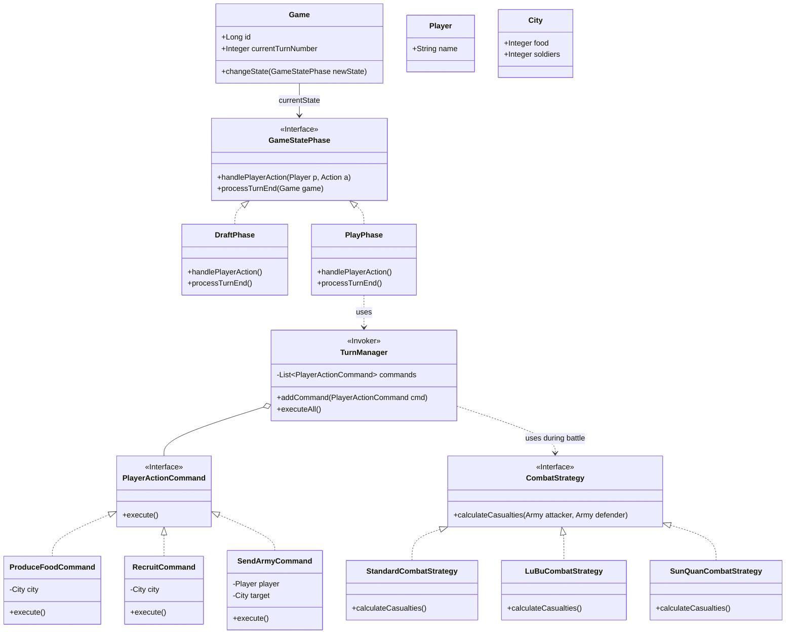

# การประยุกต์ใช้ GoF Design Patterns
ในโปรเจคเกม EternalClash2 ได้เลือกประยุกต์ใช้ Design Pattern ในกลุ่ม **Behavioral Patterns** จำนวน 3 รูปแบบ เพื่อจัดการกับความซับซ้อนของกฎกติกาและพฤติกรรมในเกม Turn-based

## 1. State Pattern
**ปัญหา:** เกมมีหลายเฟส (Waiting, Draft, Play, Finished) ซึ่งแต่ละเฟสมีกฎและการอนุญาตให้ทำ Action ที่ต่างกัน ถ้าใช้ `if-else` เช็คสถานะเกมทุกครั้งที่ API ถูกเรียก โค้ดจะซับซ้อนและบำรุงรักษายาก
**การแก้ปัญหา:** สร้าง Interface `GameStatePhase` และให้แต่ละสถานะ (เช่น `DraftPhase`, `PlayPhase`) Implement พฤติกรรมของตัวเอง เมื่อสถานะเกมเปลี่ยน เกมจะเปลี่ยน Object ของ State ไปใช้งานตัวถัดไป

## 2. Command Pattern
**ปัญหา:** ใน 1 Turn ผู้เล่นสามารถเลือกทำ Action ได้หลายแบบ (ผลิตอาหาร, สร้างทหาร, ส่งกองทัพ) ซึ่งแต่ละ Action มีขั้นตอนการทำงาน การหักทรัพยากร และการตรวจสอบกฎที่ต่างกัน
**การแก้ปัญหา:** สร้าง Interface `PlayerActionCommand` ที่มีเมธอด `execute()` แล้วสร้าง Class ย่อยสำหรับแต่ละ Action เมื่อผู้เล่นส่งคำสั่ง ระบบจะนำ Command เหล่านี้ไปเข้าคิว (Queue) ใน `TurnManager` เพื่อรอประมวลผลพร้อมกันเมื่อจบ Turn

## 3. Strategy Pattern
**ปัญหา:** จอมพลแต่ละตัวมีอัตราการฆ่า (Kill Ratio) และความสามารถในการต่อสู้ไม่เหมือนกัน (เช่น ทั่วไป 1:1, ลิโป้ 1:2, ซุนกวน 1.5:1) การเขียน `if-else` เช็คชื่อจอมพลใน Service การต่อสู้จะทำให้โค้ดพันกันและเพิ่มจอมพลในอนาคตยาก
**การแก้ปัญหา:** สร้าง Interface `CombatStrategy` สำหรับคำนวณความสูญเสีย และแยกการคำนวณของจอมพลพิเศษออกเป็น Class ของตัวเอง (เช่น `LuBuCombatStrategy`, `SunQuanCombatStrategy`) ระบบต่อสู้เพียงแค่เรียกใช้ `calculateCasualties()` โดยไม่ต้องสนว่าข้างในคำนวณอย่างไร

---

## Class Diagram (เน้นส่วน Design Pattern)

