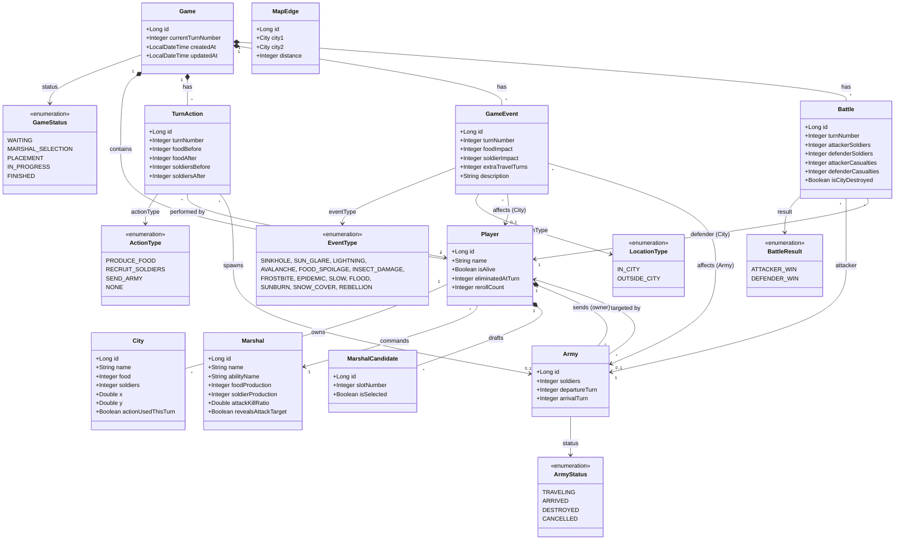

# Domain Class Diagram (Entity Model)

แผนภาพ Class Diagram นี้นำเสนอโครงสร้างข้อมูล (Entity) และ Enumeration ทั้งหมดในระบบเกม EternalClash2 ซึ่งแมป (Map) กับโครงสร้างของฐานข้อมูลผ่าน Spring Data JPA โดยตรง

## แผนภาพโครงสร้างรวม (Full System Entities)

