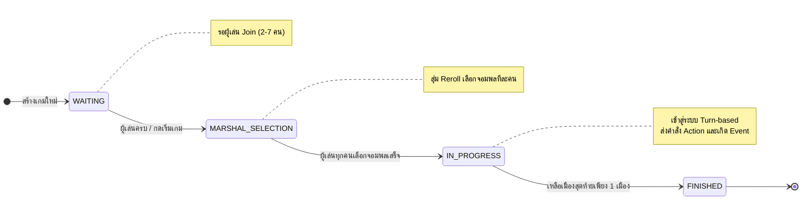
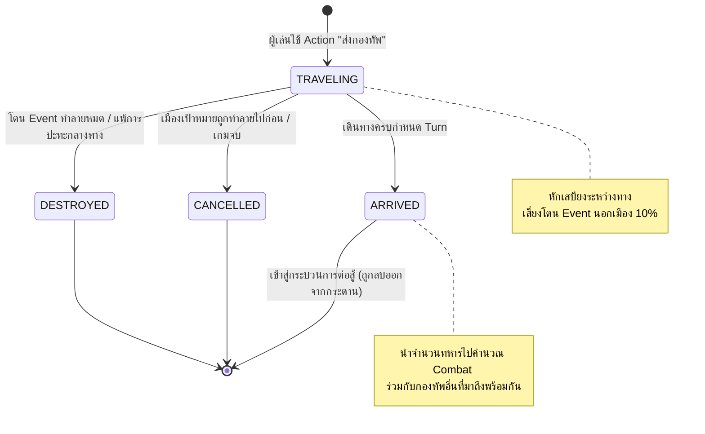

# State Diagrams

ในระบบเกม EternalClash2 มี Entity หลักที่มีการเปลี่ยนแปลงสถานะ (State) อย่างชัดเจนระหว่างการทำงานของระบบ จำนวน 2 Entity ได้แก่ `Game` และ `Army`

## 1. Game State Diagram
วงจรชีวิตของ "ห้องเกม" ตั้งแต่เริ่มต้นสร้างห้อง ไปจนถึงหาผู้ชนะได้

---

## 2. Army State Diagram
วงจรชีวิตของ "กองทัพ" ตั้งแต่ถูกส่งออกจากเมือง จนถึงจุดหมายหรือถูกทำลายกลางทาง

