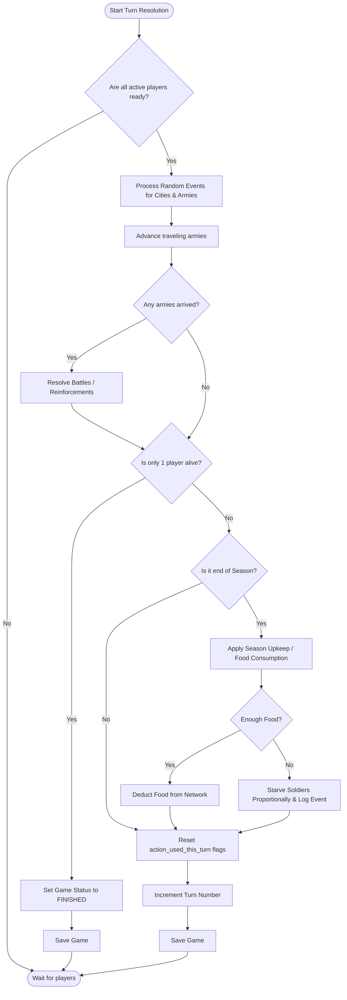

# Activity Diagram

> **คืออะไร (What is this?)**
> แผนภาพแสดงลำดับขั้นตอนการทำงานของระบบ (Workflow/Algorithm) ที่มีความซับซ้อนและมีเงื่อนไขการตัดสินใจ (Decision)
> 
> **ใช้ทำไมและเพื่ออะไร (Why & Purpose)**
> ใช้อธิบายลอจิกส่วนที่ซับซ้อนที่สุดของเกม คือช่วงประมวลผลเมื่อจบเทิร์น (Resolve Turn) เพื่อให้ทีมพัฒนาเห็นภาพรวมว่าต้องคำนวณอะไรก่อน-หลัง (เช่น สุ่มอีเวนต์ -> เดินทัพ -> หักเสบียง) ป้องกันการเขียนลำดับโค้ดผิดพลาด

## Turn Resolution Process
แสดงการทำงานของระบบเมื่อผู้เล่นทุกคนกดส่งคำสั่งครบ และระบบทำการคำนวณผลลัพธ์ของเทิร์น (Resolve Turn)

