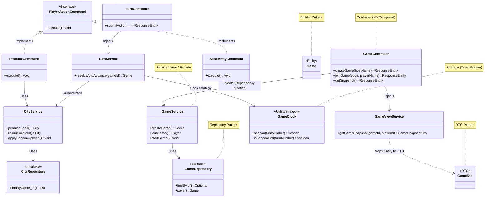

# Class Diagram (Design Patterns Included)

> **คืออะไร (What is this?)**
> แผนภาพแสดงโครงสร้างเชิงลึกของโค้ดโปรแกรม ประกอบด้วยคลาส อินเตอร์เฟซ และความสัมพันธ์ระหว่างคลาสในเชิงเทคนิค
> 
> **ใช้เทคนิคอะไร (Techniques Used)**
> - **Architectural Patterns**: Layered Architecture, MVC, Repository, DTO, Dependency Injection
> - **GoF Design Patterns**: Strategy (GameClock), Facade (GameViewService), Command (PlayerAction), Builder (Entity)
> 
> **ใช้ทำไมและเพื่ออะไร (Why & Purpose)**
> ใช้เป็นคู่มือสำหรับนักพัฒนาในการเขียนโค้ดจริง (Implementation) แผนภาพนี้จะช่วยอธิบายว่าโค้ดโครงสร้างใหญ่นี้ถูกจัดระเบียบด้วย Design Pattern อย่างไร เพื่อให้อ่านง่าย ดูแลรักษาง่าย และขยายขีดความสามารถได้ง่ายในอนาคต (หลักการ SOLID)

แสดงภาพรวมของ Class Architecture และ Design Patterns ที่ใช้ในระบบ (ย่อเฉพาะคลาสสำคัญเพื่อความชัดเจน)

