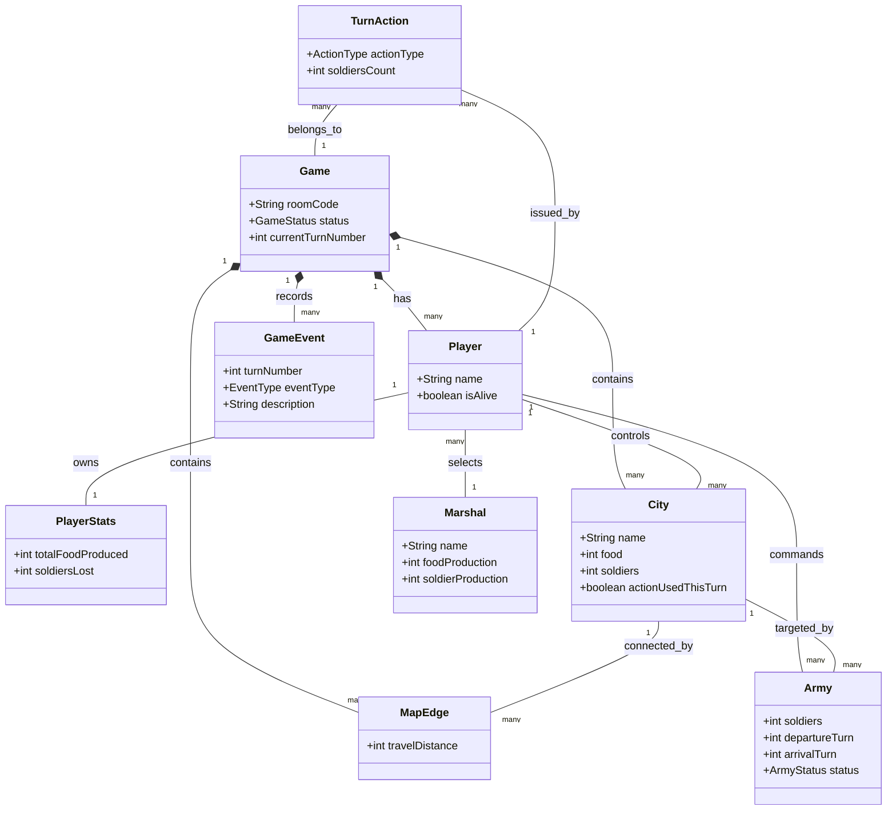

# Domain Model / Conceptual Class Diagram

> **คืออะไร (What is this?)**
> แผนภาพคลาสในระดับแนวคิด ที่มุ่งเน้นไปที่การอธิบาย "คำศัพท์" (Ubiquitous Language) และวัตถุหลักๆ ในโลกของปัญหา (Domain) โดยไม่สนเรื่องเทคนิคเชิงลึก (เช่น ไม่มี Controller หรือ Repository)
> 
> **ใช้เทคนิคอะไร (Techniques Used)**
> แนวคิดเบื้องต้นของ Domain-Driven Design (DDD)
> 
> **ใช้ทำไมและเพื่ออะไร (Why & Purpose)**
> ใช้เพื่อทำความเข้าใจ Business Logic ของเกม EternalClash2 ในมุมมองของผู้เชี่ยวชาญ/ผู้เล่นเกม เพื่อให้โปรแกรมเมอร์และทีมงานอื่นๆ มองเห็นโครงสร้างของเกมตรงกัน

แสดงความสัมพันธ์ของ Entity หลักในระบบโดยเน้นที่ระดับแนวคิด (Conceptual Level)

