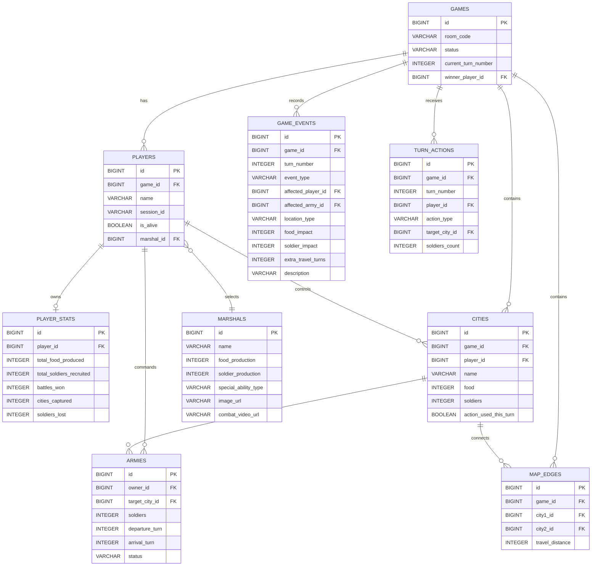

# Entity-Relationship (ER) Diagram

> **คืออะไร (What is this?)**
> แผนภาพแสดงโครงสร้างและการเชื่อมโยงข้อมูลในฐานข้อมูล (Database Schema)
> 
> **ใช้เทคนิคอะไร (Techniques Used)**
> ออกแบบฐานข้อมูลเชิงสัมพันธ์ (Relational Database) โดยใช้ความสัมพันธ์แบบ One-to-One, One-to-Many ตามหลักการ Normalization
> 
> **ใช้ทำไมและเพื่ออะไร (Why & Purpose)**
> เพื่อใช้เป็นแกนหลักในการสร้าง Entity Class สำหรับ Spring Data JPA (Hibernate) ทำให้รู้ว่าแต่ละตารางต้องมี Foreign Key โยงหากันอย่างไร ช่วยให้เก็บข้อมูลสถานะของเกมและผู้เล่นได้อย่างถูกต้องและลดความซ้ำซ้อนของข้อมูล

