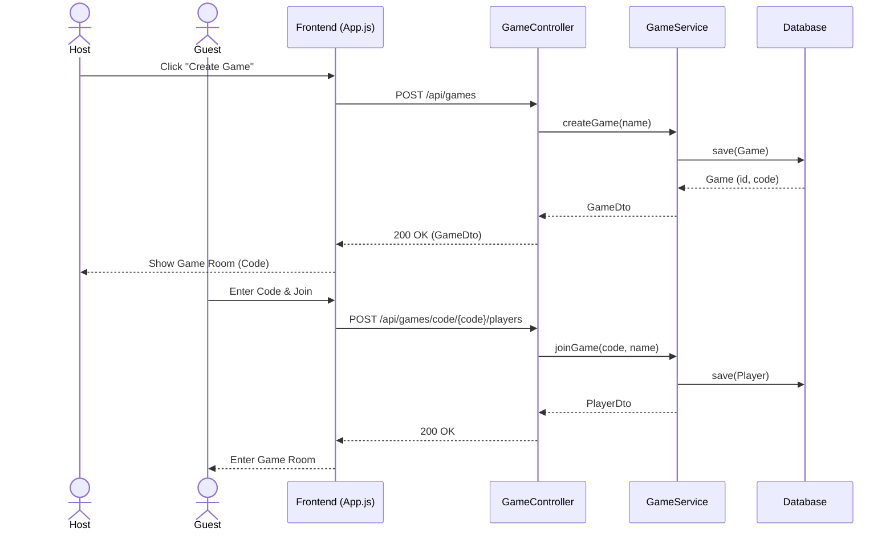
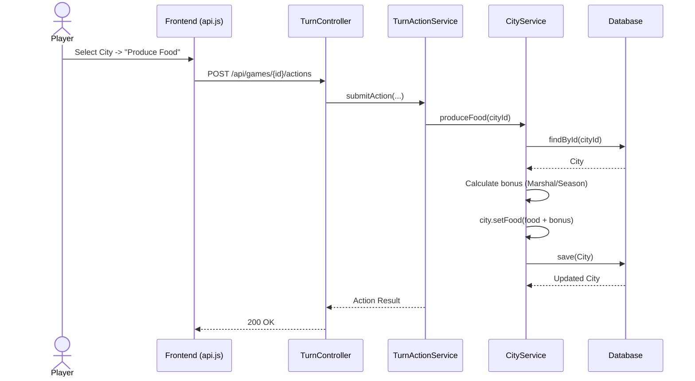
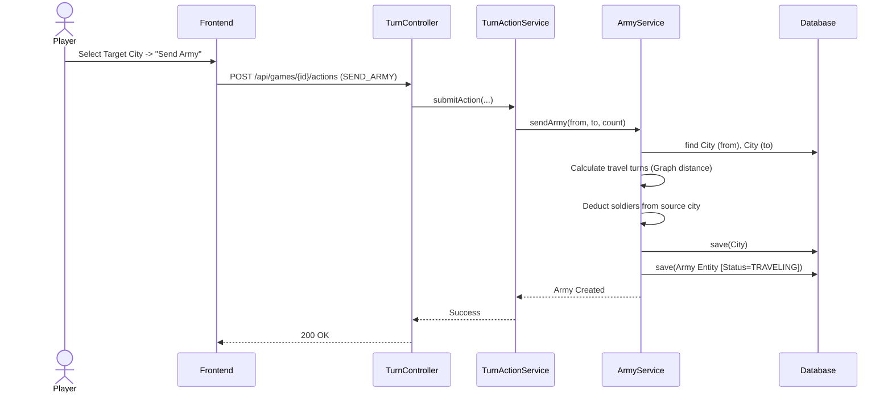

# Sequence Diagrams

> **คืออะไร (What is this?)**
> แผนภาพแสดงลำดับการทำงาน (Flow of Messages) ระหว่าง Object หรือ Layer ต่างๆ ตามเส้นเวลา (Timeline) เพื่อทำภารกิจหนึ่งๆ ให้สำเร็จ
> 
> **ใช้เทคนิคอะไร (Techniques Used)**
> แสดงให้เห็นถึงการสื่อสารในรูปแบบ Layered Architecture (Client -> Controller -> Service -> Repository -> Database) ในแต่ละ Request ที่เข้ามา
> 
> **ใช้ทำไมและเพื่ออะไร (Why & Purpose)**
> ใช้เพื่อออกแบบลอจิกการทำงานเชิงลึกในแต่ละ Use Case ทำให้รู้ว่าเวลามี Request เข้ามา จะต้องเรียกคลาสไหน เมธอดอะไร ใครคุยกับใครบ้าง และส่งข้อมูลอะไรกลับไป ช่วยให้เห็นภาพรวมของ Data Flow และลดบั๊กระหว่างการเขียนโค้ดจริง

## Scenario 1: Create Game and Join

## Scenario 2: Produce Food Action

## Scenario 3: Send Army to Attack

