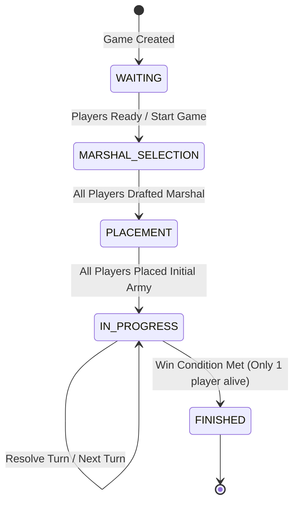
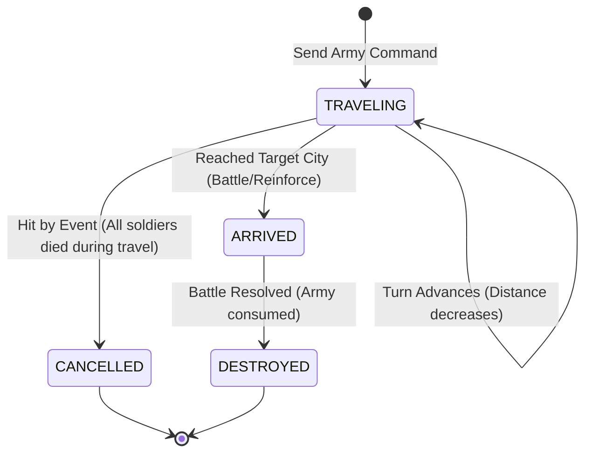

# State Diagrams

> **คืออะไร (What is this?)**
> แผนภาพแสดงการเปลี่ยนแปลงสถานะ (State Transition) ของออบเจกต์หนึ่งๆ ตลอดวงจรชีวิต (Lifecycle)
> 
> **ใช้เทคนิคอะไร (Techniques Used)**
> Finite State Machine (FSM) ในการควบคุมสถานะไม่ให้ข้ามขั้นตอนอย่างผิดกฎ เช่น กองทัพต้องเริ่มเดินทางก่อน ถึงจะเข้าปะทะได้
> 
> **ใช้ทำไมและเพื่ออะไร (Why & Purpose)**
> ใช้เพื่อออกแบบลอจิกควบคุม Flow ของเกม (Game Status) เช่น ต้องรอให้ผู้เล่นสุ่มขุนพล (MARSHAL_SELECTION) ให้ครบก่อน ถึงจะไปสเตปวางกำลัง (PLACEMENT) ได้ ช่วยป้องกันบั๊กการทำแอ็กชันข้ามขั้นตอน

## Game State Machine
แสดงการเปลี่ยนสถานะของเกม (Game Entity) ตั้งแต่เริ่มสร้างห้องจนจบเกม

## Army State Machine
แสดงการเปลี่ยนสถานะของกองทัพ (Army Entity) เมื่อถูกส่งออกไปโจมตีหรือสนับสนุน

