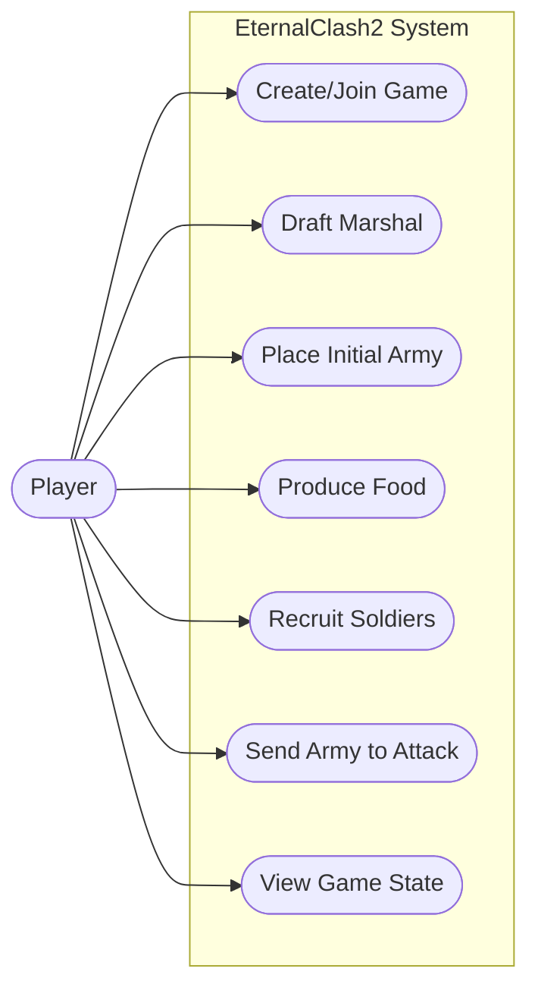

# Use Case Diagram & Description

> **คืออะไร (What is this?)**
> แผนภาพที่แสดงความสัมพันธ์ระหว่างผู้ใช้งาน (Actor) กับระบบ (System) ว่าผู้ใช้งานสามารถทำอะไรกับระบบได้บ้าง
> 
> **ใช้ทำไมและเพื่ออะไร (Why & Purpose)**
> ใช้เพื่อเก็บรวบรวม Requirements (ความต้องการของระบบ) และเพื่อให้เห็นภาพรวมเบื้องต้นว่าระบบเกม EternalClash2 มีฟีเจอร์หลักอะไรบ้างที่ผู้เล่นสามารถตอบโต้ได้ (เช่น การสร้างเกม, การสุ่มขุนพล, การเกณฑ์ทหาร) ทำให้ทีมพัฒนาเข้าใจเป้าหมายตรงกัน

## Use Case Diagram

*Note: Use Mermaid's `flowchart` if your renderer doesn't support `usecaseDiagram` natively, though modern Mermaid supports actor and use case mappings.*

---

## Use Case Description

### UC1: Create/Join Game
- **Actor:** Player
- **Description:** ผู้เล่นทำการสร้างห้องใหม่ (ระบบจะคืน Game Code ให้) หรือกรอกรหัสเพื่อเข้าร่วมห้องเกมที่มีอยู่แล้ว
- **Main Flow:**
  1. ผู้เล่นเข้าสู่ระบบและระบุชื่อ
  2. เลือกว่าจะสร้างห้องใหม่ หรือเข้าร่วมห้อง
  3. ระบบเพิ่มผู้เล่นเข้าไปในเกม และเมื่อครบ/พร้อม จะเปลี่ยนสถานะเกมเป็น MARSHAL_SELECTION

### UC2: Draft Marshal
- **Actor:** Player
- **Description:** ผู้เล่นทำการสุ่มเลือกขุนพล (Marshal) จากตัวเลือก 3 ตัว เพื่อรับโบนัสทักษะพิเศษ
- **Main Flow:**
  1. ระบบสุ่มขุนพลมาให้ 3 ตัว
  2. ผู้เล่นเลือกขุนพล 1 ตัว (สามารถสุ่มใหม่ได้ 1 ครั้งตามกฎ)
  3. ระบบบันทึกขุนพลให้ผู้เล่น

### UC3: Place Initial Army
- **Actor:** Player
- **Description:** ผู้เล่นเลือกเมืองเริ่มต้นของตนเองบนแผนที่
- **Main Flow:**
  1. ระบบแสดงเมืองที่เป็นไปได้
  2. ผู้เล่นคลิกเลือกเมืองเพื่อวางกำลังตั้งต้น
  3. เมื่อทุกคนวางครบ เกมเปลี่ยนสถานะเป็น IN_PROGRESS

### UC4: Produce Food
- **Actor:** Player
- **Description:** ผู้เล่นสั่งเมืองให้ผลิตเสบียงในเทิร์นนั้น
- **Main Flow:**
  1. ผู้เล่นเลือกเมืองของตนเองที่ยังไม่ได้ใช้ Action
  2. กดปุ่มผลิตเสบียง
  3. ระบบเพิ่มเสบียงให้เมืองตามความสามารถของขุนพลและฤดูกาล
  4. เมืองนั้นหมดสิทธิ์ทำ Action อื่นในเทิร์นนั้น

### UC5: Recruit Soldiers
- **Actor:** Player
- **Description:** ผู้เล่นสั่งเมืองให้เกณฑ์ทหารใหม่ในเทิร์นนั้น
- **Main Flow:**
  1. ผู้เล่นเลือกเมืองของตนเองที่ยังไม่ได้ใช้ Action
  2. กดปุ่มเกณฑ์ทหาร
  3. ระบบหักเสบียงรวมของเมืองที่เชื่อมต่อกัน (Network)
  4. หากเสบียงพอ ระบบเพิ่มทหารให้เมืองนั้น

### UC6: Send Army to Attack
- **Actor:** Player
- **Description:** ผู้เล่นส่งกองทัพจากเมืองหนึ่งไปยังอีกเมืองหนึ่ง (เพื่อโจมตีหรือสนับสนุน)
- **Main Flow:**
  1. ผู้เล่นเลือกเมืองต้นทางและเมืองปลายทาง
  2. ระบุจำนวนทหารที่ต้องการส่ง
  3. ระบบสร้าง Entity กองทัพ (Army) ที่เดินทางในแผนที่

### UC7: View Game State
- **Actor:** Player
- **Description:** ผู้เล่นดูสถานะเกมทั้งหมด ทั้งฤดูกาล เทิร์น เสบียง จำนวนทหาร และตำแหน่งกองทัพ
- **Main Flow:**
  1. ไคลเอนต์ยิง Polling ขอข้อมูลล่าสุด
  2. ระบบรวมข้อมูลจากหลาย Repository (Facade Pattern) คืนกลับไปให้แสดงผล
